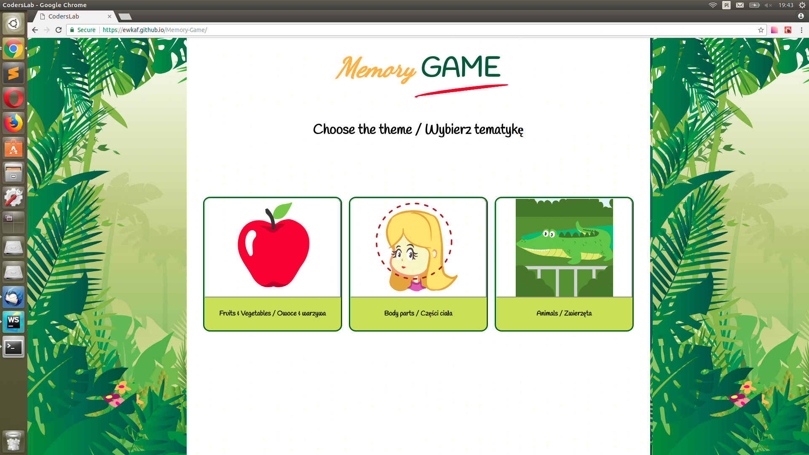

# Memory-Game
This is a memory game app built with React.

## General info
The game was written as final project at programming bootcamp JavaScript Developer: React.
It was built with the purpose of helping kids to teach English by game. Players may choose one of the theme and enjoy the game. For more efficient learning turn on the sound.

## Built with:
* react
* Sass
* webpack

## Screenshots

Github Pages: https://ewkaf.github.io/Memory-Game/
